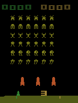
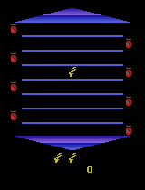
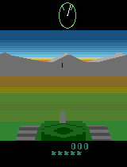
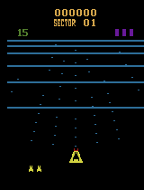
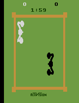
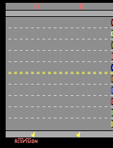
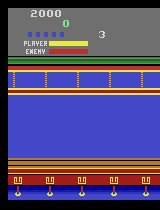
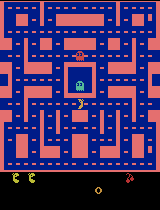
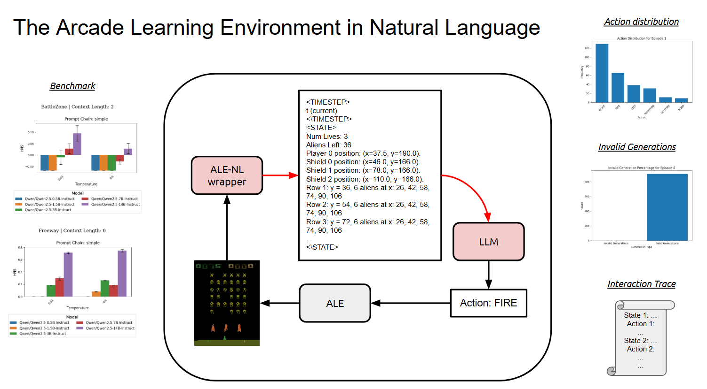

# 🎮 ALE-NL: The Arcade Learning Environment in Natural Language

Please refer to the [project report](ALE_NL.pdf) for a comprehensive overview.

**ALE-NL** supports the Arcade Learning Environment (ALE) with Large Language Models (LLMs), enabling LLMs to **interact with and be evaluated on Atari games** through natural language. Built on top of [OCAtari](https://github.com/k4ntz/OC_Atari), it allows systematic, interpretable, and **reproducible** benchmarking of LLMs in classic Atari games.

<table>
<tr>
<td></td>
<td></td>
<td></td>
<td></td>
</tr>
<tr>
<td></td>
<td></td>
<td></td>
<td></td>
</tr>
</table>

---

## 🧠 Overview

ALE-NL translates game states into natural language descriptions that are easy to consume for LLMs. It provides a simple yet powerful interface to:

- Benchmark LLMs on Atari tasks 🏆
- Analyze and visualize behavior 🤖📊
- Reproduce results with ease 🔁

<p align="center">
  
</p>

---

## ✅ Features

- [x] 12 Atari games supported (adding more!):  
  `Asterix`, `BattleZone`, `BeamRider`, `Bowling`, `Boxing`, `Breakout`, `DemonAttack`, `Freeway`, `KungfuMaster`, `MsPacman`, `Seaquest`, `SpaceInvaders`
- [x] Run any HuggingFace `text-generation` model locally 💻
- [x] Run OpenAI models via API ☁️
- [x] Modular and customizable prompting strategies (CoT, zero-shot, few-shot)
- [x] Easy ablation of sampling parameters (temperature, context length, etc.)
- [x] One-click benchmarking: [`plot_benchmark_results.ipynb`](plot/plot_benchmark_results.ipynb)
- [x] Visual + statistical debugging:  
  - [Action distributions](static/gpt4o_actiondist.png)  
  - [Generation errors](static/gpt4o_generation_errors.png)  
  - [Full interaction traces](static/gpt4o_spaceinvaders_interaction_trace.txt)  

---

## ✨ Prompting Pipeline

Prompt templates are modularly composed from:

1. **Game Descriptions**: Loaded from `src/captions/game_descriptions/` (from [ALE docs](https://ale.farama.org/environments/)).
2. **Prompt Chains**: Found in `prompt_chains/` to enable CoT, zero-shot, few-shot, etc.
3. **State Descriptions**: Defined per game in `src/captions/games/`. Customizable for each game.

<p align="center">
  
</p>

---

## ⚙️ Installation

We recommend using `conda`, but any Python 3.8+ virtual environment should work.

```bash
conda create -n ale-nlp python=3.8 -y
conda activate ale-nlp
```

### ☁️ Running OpenAI Models

Only requires OpenAI's API client:

- Make sure your `pip` is up to date by running `pip install --upgrade pip`.

```bash
pip install -r requirements_api.txt
```

- Make sure to set your OpenAI API key: `export OPENAI_API_KEY=<your_key>` or `conda env config vars set OPENAI_API_KEY=<your_key>`.

### 🧠 Running LLMs Locally

Install dependencies with CUDA support:

```bash
conda install -c conda-forge cudatoolkit-dev
pip install transformers[torch]
pip install -r requirements_local.txt
```

### 🔁 Final Setup

Necessary final step:

```bash
pip install -e .
```

---

## 🚀 Running

Running any LLM in an Atari game is just one command away!  
Simply pass the appropriate model name and environment ID to `src/run.py`:

- **`<LLM_NAME>`**: Must be a valid model ID from either:
  - 🤗 HuggingFace (e.g., `Qwen/Qwen2-0.5B`)
  - 🧠 OpenAI (e.g., `gpt-3.5-turbo-0125`)

- **`<ENV_ID>`**: The Atari game name (e.g., `SpaceInvaders`, `MsPacman`, `Asterix`, ...)

```bash
python src/run.py --model_name=<LLM_NAME> --env_id=<ENV_ID>
```

Additional options can be passed for fine-grained control:
- `--prompt_chain_path`: Selects a prompting strategy
- `--temperature`: Controls sampling randomness
- `--context_length`: Limits the LLM input length
- _...and more!_

e.g. Run `gpt-3.5-turbo-0125` on `SpaceInvaders` with a CoT prompting strategy:

```bash
python src/run.py --model_name=gpt-3.5-turbo-0125 --env_id=SpaceInvaders --prompt_chain_path=prompt_chains/think_stepbystep
```

e.g. Run `gpt-4o` on `Freeway` with a zero-shot prompting strategy:

```bash
python src/run.py --model_name=gpt-4o --env_id=Freeway --prompt_chain_path=prompt_chains/simple
```

e.g. If installed locally, run `Qwen/Qwen2.5-0.5B` on `SpaceInvaders` with a CoT prompting strategy:

```bash
python src/run.py --model_name=Qwen/Qwen2.5-0.5B --env_id=SpaceInvaders --prompt_chain_path=prompt_chains/think_stepbystep
```

(You can cancel the process at any time by pressing `Ctrl+C` or `Ctrl+Z` + `pkill python`)

📁 All logs, outputs, and interaction traces will be automatically saved in the `results` directory.

👉 For the full list of options, check [`src/run.py`](src/run.py).

👉 After running, you can visualize the results with [`plot/plot_benchmark_results.ipynb`](plot/plot_benchmark_results.ipynb).

👉 The full interaction trace, video, and logs are also saved in the `results` directory.

## 📬 Contribute or Explore More

Got a new game, prompt strategy, or LLM you want to try? Contributions and suggestions are welcome!

---

## 📚 Citation

If you use **ALE-NL** in your research, please consider citing it using the following format:

```bibtex
@misc{ale-nl2025,
  title     = {ALE-NL: The Arcade Learning Environment in Natural Language},
  author    = {Creus Castanyer, Roger},
  year      = {2025},
  url       = {https://github.com/roger-creus/ale-nl},
  note      = {Accessed: 2025-04-16}
}
```
